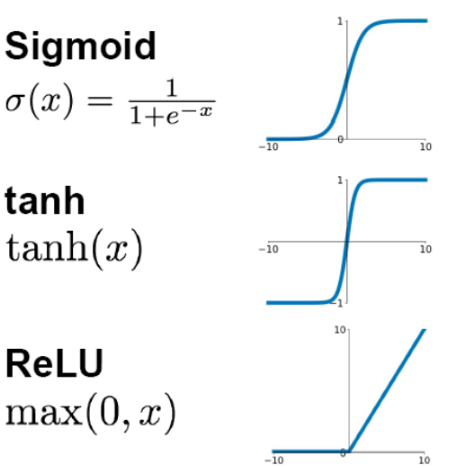

* 采用sigmoid等函数，算激活函数时计算量大，反向传播求误差梯度时，求导涉及除法和指数运算，计算量相对较大，而采用Relu激活函数，整个过程的计算量节省很多。
* 对于深层网络，sigmoid函数反向传播时很容易出现梯度消失的情况（在sigmoid接近饱和区时，变换太缓慢，导数趋于0，这种情况会造成信息丢失），这种现象称为饱和，从而无法完成深层网络的训练。而Relu就不会有饱和倾向，不会有特别小的梯度出现。
* Relu会使一部分的神经元的输出为0，这样就造成了网络的稀疏性，并且减少了参数的相互依存关系，缓解了过拟合问题的发生。