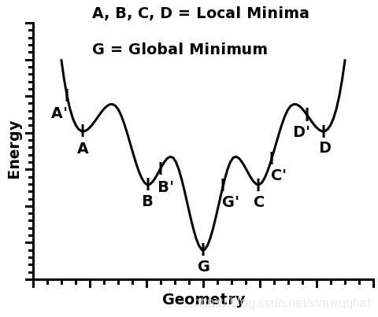

实际情况中，我们可能从来没有找到过“局部最优”，更别说全局最优了、很多人都有一种看法，就是“局部最优是神经网络优化的主要难点。”

</img>

直观的想象，高维的时候这样的局部极值会更多，指数级的增加，于是优化到全局最优就更难了。

现在来看，神经网络的训练的困难问题主要是鞍点问题。在实际中，我们很可能从来没有真的遇到过局部极值。不过，即使有局部极值，具有较差loss的局部极值的吸引域也是很小的。所以实际上很多时候是在“什么也没找到”的情况下就停止了训练，然后拿到测试集上试试却发现“效果不错”。