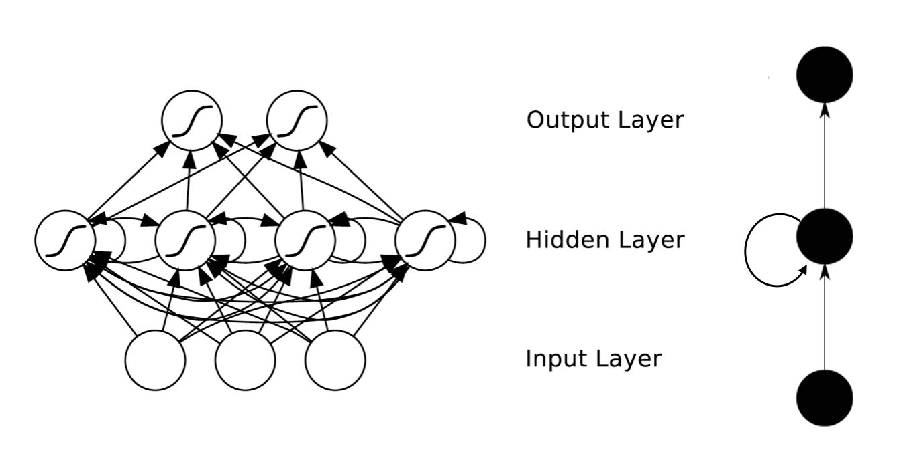
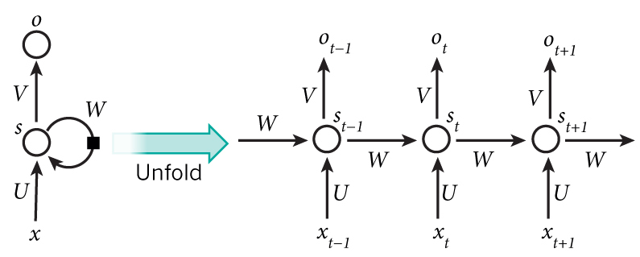

RNN的目的是用来处理序列数据。在传统的神经网络模型中，是从输入层到隐藏层再到输出层，层与层之间是全连接的，每层之间的节点是无连接的。但是这种普通的神经网络对于很多问题却无能为力，例如预测句子的下一个单词是什么，一般需要用到前面的单词，因为一个句子中前后单词并不是独立的。

RNN之所以成为循环神经网络，是因为一个序列当前的输出与前面的输出也有关。具体的表现形式是网络会对前面的信息进行记忆并应用于当前输出的计算中，即隐藏层之间的节点不再无连接而是有连接的，并且隐藏层的输入不仅包括输入层的输出还包括上一时刻隐藏层的输出。

</img>

</img>
