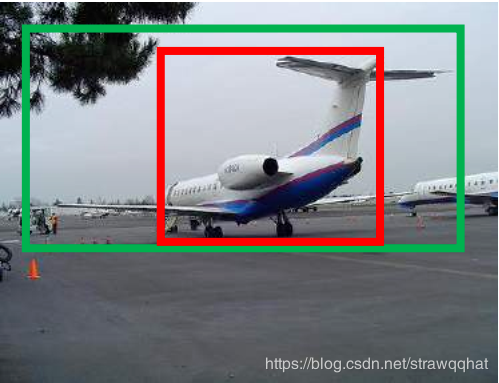
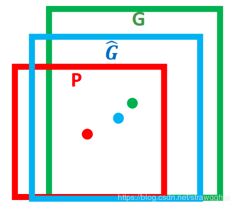

如上图所示，绿色的框表示真实值，红色的框表示选择搜索提取的候选区域(region proposal)，那么即使红色的框被分类器识别为飞机，但是由于红色的框定位不准，这张图也相当于没有正确的检测出飞机。

如果能对红色的框进行微调，使得经过微调后的窗口跟ground truth更接近，这样会使定位更准确，边框回归就是用来微调这个窗口的。

边框回归的目的即是：给定(Px,Py,Pw,Ph)寻找一种映射f， 使得f(Px,Py,Pw,Ph)=(Gx^,
Gy^ ,Gw^ ,Gh^ )并且(Gx^ ,Gy^ ,Gw^ ,Gh^)≈(Gx,Gy,Gw,Gh)。

那么边框回归是怎么做的呢？平移+尺度放缩

* 平移：
G^x=Pw * dx+Px
G^y=Ph * dy+Py
* 放缩：
G^w=Pw * exp(dw)
G^h=Ph * exp(dh)

函数优化目标是：
W∗ = argminw∗∑iN(ti∗ − w ^ T ∗ ϕ5(Pi))2+λ||w^∗||2

注：w ^ T ∗ ϕ5(P)是得到的预测值，t*是真实值。